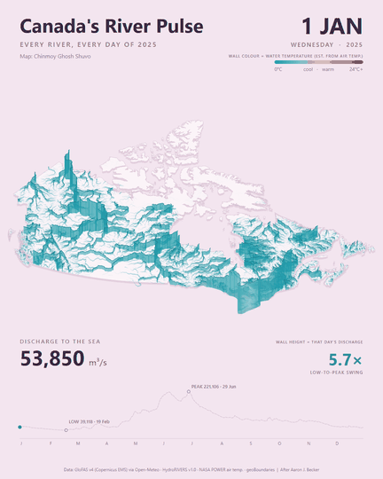
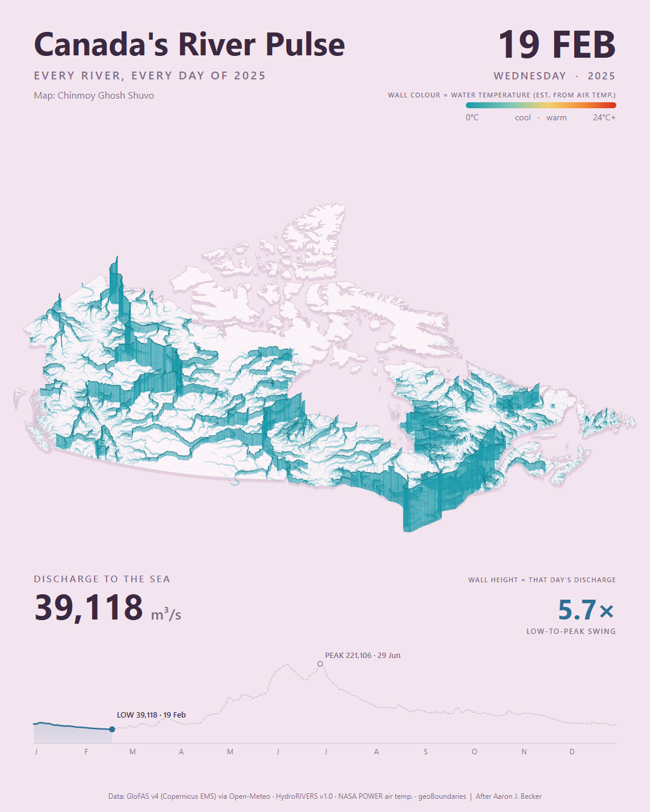
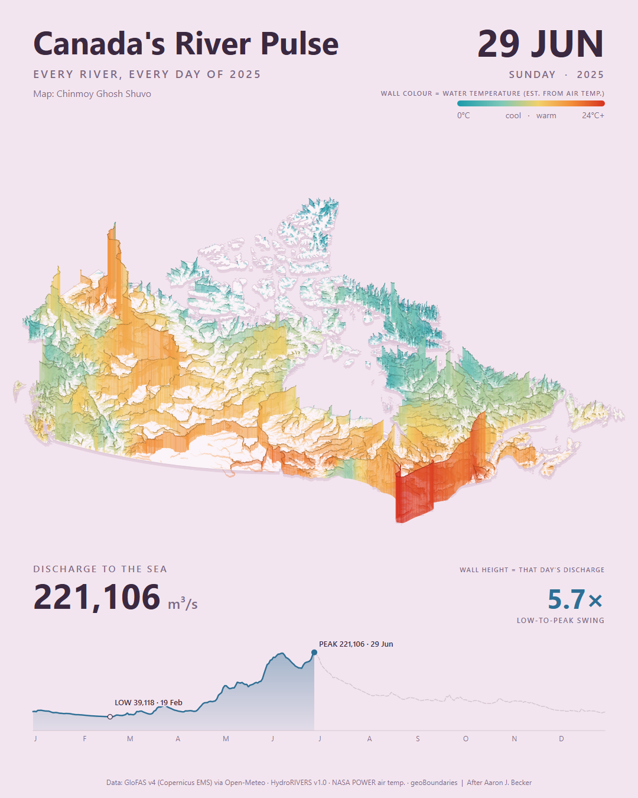
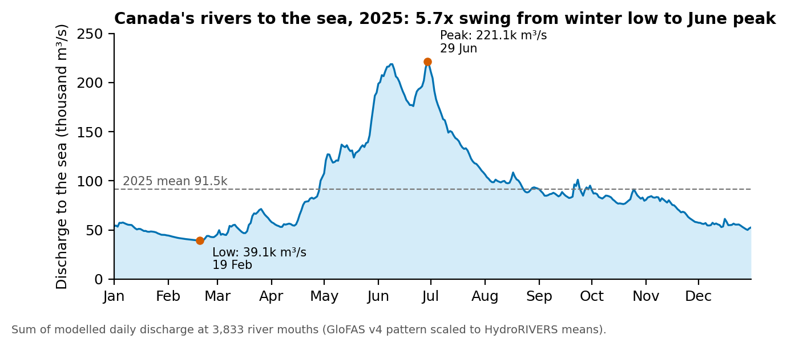

# Canada's River Pulse 2025: Every River, Every Day

**Personal portfolio project (individual work)** · Chinmoy Ghosh Shuvo · September 2026

## Summary

An animated 3D map of every mapped river in Canada on every day of 2025. Each river rises from a tilted map as a wall: its **height is that day's discharge** and its **colour is the estimated water temperature**. A running counter adds up the discharge of all 3,833 Canadian river mouths. Together they flow from a low of about **39,100 m³/s on 19 February** to a peak of about **221,100 m³/s on 29 June**, a 5.7-fold seasonal swing. The design follows Aaron J. Becker's "South Asia's River Pulse".

*Preview (every 14th day). Full 365-day video: [`images/canada-river-pulse-2025.mp4`](images/canada-river-pulse-2025.mp4)*

## Study area

**Canada**, all HydroRIVERS reaches with a long-term mean discharge of at least 1 m³/s: **173,757 reaches** and **3,833 river mouths**. Rivers that reach the sea through the United States (e.g. Yukon, Columbia) are not counted.

## Data

| Dataset | Used for | Resolution / period |
|---|---|---|
| HydroRIVERS v1.0 (Lehner & Grill 2013) | River network, long-term mean discharge, downstream links, mouths | Vector reaches |
| GloFAS v4.0 river discharge via Open-Meteo Flood API | Day-to-day discharge pattern | 0.05°, daily 2025 |
| NASA POWER 2 m air temperature (MERRA-2) | Estimated water temperature | 658 points on a 2° grid, daily |
| geoBoundaries CAN ADM0 | Canada outline | Simplified polygon |

## Method

1. **Network:** kept reaches ≥ 1 m³/s inside Canada, added back cut-off estuaries and the Great Lakes–St. Lawrence chain, and identified sea-draining mouths.
2. **Daily discharge:** sampled 194 large reaches and matched each to the GloFAS cell whose September 2025 flow best fitted the HydroRIVERS mean. 177 samples passed the check. Every reach then borrowed the 2025 daily pattern of its nearest downstream (or same-system, or nearest) sample, scaled to its own long-term mean.
3. **Water temperature:** 7-day trailing mean of air temperature, interpolated to reaches by inverse-distance weighting and floored at 0 °C.
4. **Rendering:** Canada Atlas Lambert projection, vertical tilt, and QGIS geometry-generator walls (height = 4,000 × √Q m). 365 frames (1080 × 1350) were rendered with PyQGIS and Qt overlays, then encoded with FFmpeg at 24 fps.

## Results

| Low: 19 February | Peak: 29 June |
|---|---|
|  |  |

- Discharge to the sea stays near its minimum through late winter, rises with spring melt from April, and peaks in late June. The 2025 mean is about **91,500 m³/s**.
- **Limitations:** water temperature is estimated from air temperature. Most rivers borrow a sampled river's daily pattern. Totals are tied to long-term means, so they show the seasonal rhythm but not whether 2025 was a wet or dry year. GloFAS is a model, not gauge data.

## Code

- [`code/fetch_river_pulse_data.py`](code/fetch_river_pulse_data.py): downloads GloFAS discharge (with neighbourhood screening) and NASA POWER temperature. It runs in the QGIS Python console, with caching and rate limiting.
- [`code/render_river_pulse.py`](code/render_river_pulse.py): builds the daily series, the 3D wall layers and the overlays, then renders the frames and the QGIS project.
- [`viz/make_figures.py`](viz/make_figures.py): the discharge chart above, from `viz/data/discharge_to_sea_2025.csv`.

The scripts expect a project folder at `D:\River Pulse` with the HydroRIVERS and geoBoundaries files in `raw/`. Change `ROOT` at the top of each script to use another location.

## Tools

QGIS 4.2.2 (PyQGIS, geometry generators) · Python (NumPy) · Qt · FFmpeg · Open-Meteo and NASA POWER APIs

## Contact

Chinmoy Ghosh Shuvo · Open to collaboration and knowledge sharing. Feel free to reach out on [LinkedIn](https://www.linkedin.com/in/chinmoyghosh034).

## References

Lehner & Grill (2013) *Hydrological Processes* 27:2171–2186 · Copernicus EMS GloFAS v4.0 · NASA POWER / MERRA-2 (Gelaro et al. 2017) · Runfola et al. (2020) geoBoundaries · Zippenfenig (2023) Open-Meteo · Design concept: Aaron J. Becker, "South Asia's River Pulse". The full list is in [`report/`](report/).
